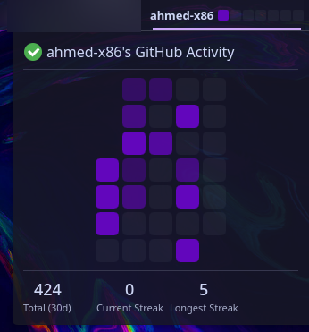

<h1 align="center">GitHub Radar for KDE Plasma</h1>

<p align="center">
  
  
  
</p>

A native, lightweight KDE Plasma 6 widget that displays a rolling GitHub contribution graph on your panel and a detailed statistics popup. Built with the **KISS philosophy** in mind—pure QML and JavaScript, utilizing the native GitHub GraphQL API without any heavy Python dependencies or background daemons.

## ✨ Features

* **Panel Integration:** Displays a sleek 7-day rolling contribution graph directly on your KDE panel.
* **Detailed Stats Popup:** Click the widget to view a full 30-day contribution grid, total contributions, your current streak, and your longest streak.
* **🔥 Streak Saver Notification:** Protect your streak! If you have 0 contributions by 8:00 PM local time, the widget triggers a native KDE Plasma system notification to remind you.
* **Interactive UI:** Hover over cells to see exact contribution counts and dates. Click on any cell to open your GitHub profile in your default browser.
* **Highly Customizable:** 
  * Choose to display the graph only, your username only, or both.
  * Native KDE color picker to match your graph with your current Plasma theme (e.g., Catppuccin, standard GitHub green, or custom).
* **i18n Ready:** Full translation support included out of the box.

## 📸 Screenshot



## 🚀 Installation

### Prerequisites
* KDE Plasma 6+
* A GitHub Personal Access Token (PAT) with read access to your public data.

### Standard Installation

1. Clone the repository:
```bash
git clone [https://github.com/ahmed-x86/gh_radar_kde.git](https://github.com/ahmed-x86/gh_radar_kde.git)
cd gh_radar_kde
```

2. Install the Plasmoid using Plasma's native package tool:
```bash
kpackagetool6 -t Plasma/Applet -i .
```


*(To update an existing installation, use `-u` instead of `-i`)*
3. Restart the Plasma shell to load the new widget properly:
```bash
systemctl --user restart plasma-plasmashell.service
```


## ⚙️ Configuration

1. Right-click on your KDE panel and select **Add Widgets**.
2. Drag and drop **GitHub Radar** onto your panel.
3. Right-click the newly added widget and select **Configure GitHub Radar...**.
4. Enter your **GitHub Username** and your **Personal Access Token**.
5. Customize your preferred layout and graph color!

## 📜 License

This project is licensed under the [GPL-3.0-or-later](./LICENSE) License.

